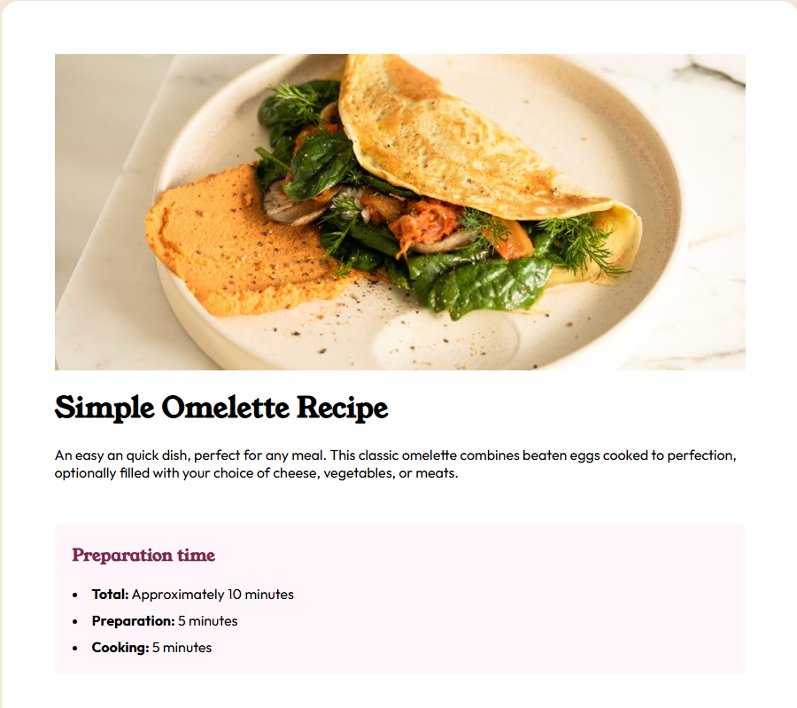
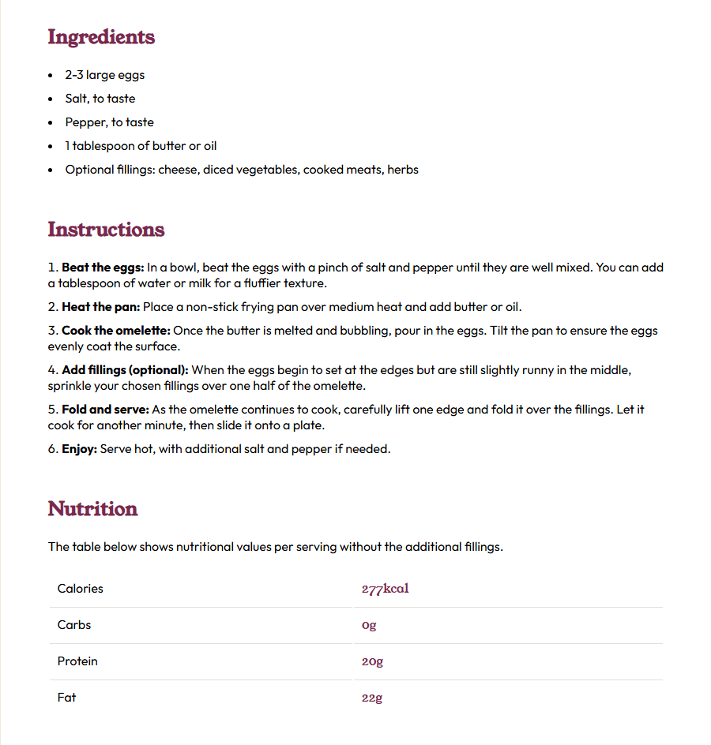

# Receita Simples de Omelete

### Projeto que visa exibir com simplicidade e beleza uma receita de omelete, contendo descrição, tempo de preparo, ingredientes, e instruções

### Linguagens Utilizadas:
- HTML5
- CSS3
